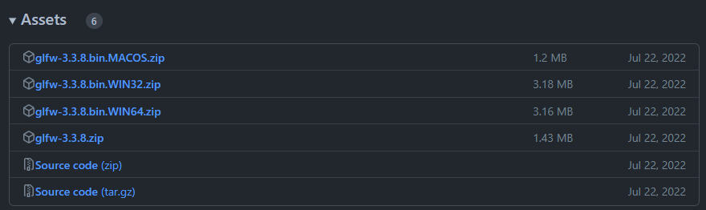
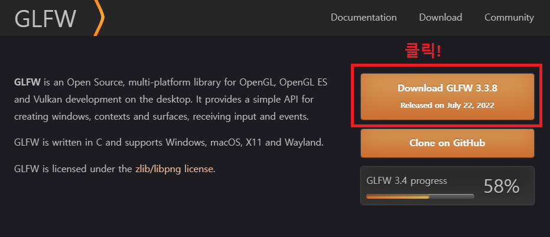
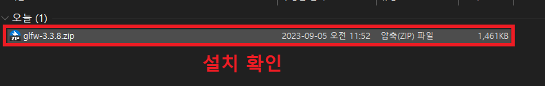
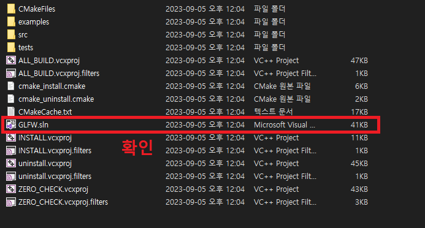
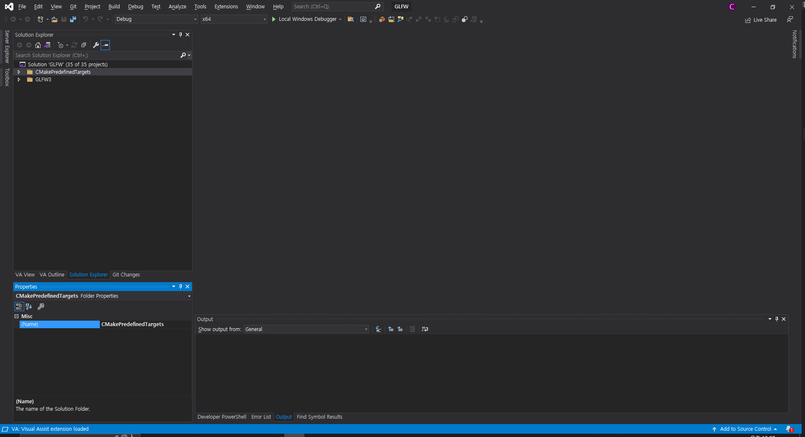
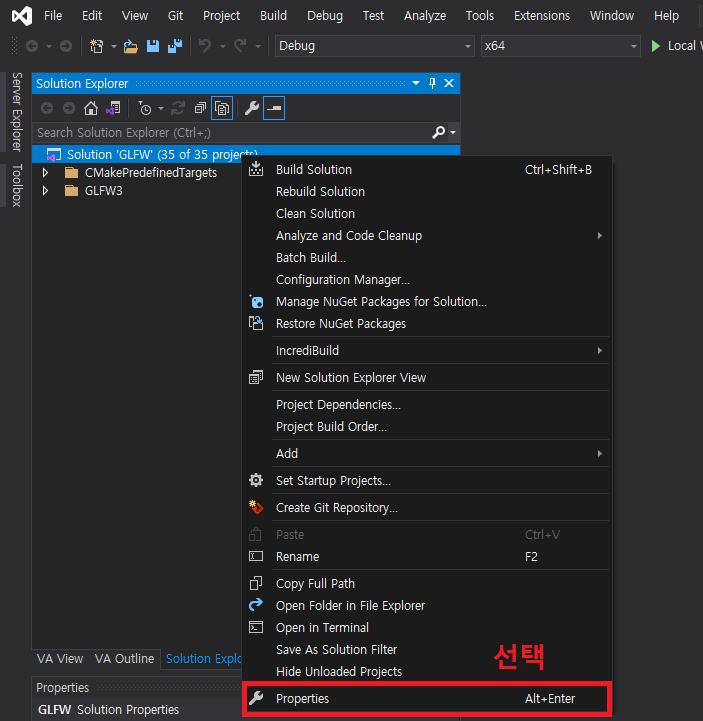
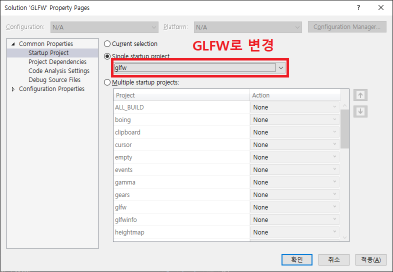

# GLFW 빌드하기

이 문서는 GLFW 빌드 과정에 대한 문서입니다.
<br><br>


## 개요

사실 GLFW는 직접 빌드할 필요가 없습니다. 아래와 같이 `glfw-3.3.8.bin.Win32` 나 `glfw-3.3.8.bin.Win64` 를 다운로드 받은 뒤에 Visual Studio 프로젝트에 적절하게 추가하면 바로 사용할 수 있습니다. 그게 싫다면 vcpkg나 nuget을 이용해서 설치 하면 바로 사용하면 됩니다.



하지만, 위 방식들에는 다음과 같은 단점이 있습니다. 

1. 바이너리 파일을 직접 다운로드 받으면 .pdb 파일이 없어 내부 디버깅을 하려면 디스어셈블된 코드로 디버깅 해야 한다.
2. vcpkg나 nuget을 사용해서 세팅하면 세팅 과정을 전혀 알 수 없다.

디스어셈블된 결과물로 디버깅 하는 것은 매우 힘든 과정이므로 1번 방식은 적절하지 않고, 프로젝트 목표 상  외부 라이브러리 세팅 자동화는 직접 수행할 예정이므로, 2번 방식 또한 적절하지 않습니다.

따라서, 프로젝트에서 사용할 GLFW 라이브러리는 직접 빌드해야 합니다.
<br><br>


## 사전 준비

GLFW를 빌드하기 위해서는 다음이 필요합니다.

- git (옵션)
- CMake (필수)
- Visual Studio 2019 or 2022 (필수)
<br><br>


## 소스 코드 얻기

GLFW를 빌드하기 위해서는 우선 소스 코드를 얻어야 하는데, 얻는 방법에는 다음 2가지가 있습니다.

1. `git clone` 명령어를 이용해서 저장소 복제본 얻기
2. GLFW 웹사이트에서 다운로드

### `git clone` 명령어를 이용해서 저장소 복제본을 얻기

`git clone` 명령어를 이용해서 저장소 복제본을 얻기 위해서는 원하는 폴더에서 CMD를 실행한 다음 아래 명령어를 입력합니다.

```bash
> git clone https://github.com/glfw/glfw
```

### GLFW 웹사이트에서 다운로드 받기

GLFW 웹사이트에서 다운로드 받기 위해서는 [여기](https://www.glfw.org/) 를 방문 후 아래의 이미지의 Download GLFW 3.3.8을 클릭합니다.



설치가 끝났으면 glfw-3.3.8.zip 파일을 볼 수 있습니다.



해당 압축파일을 풀면 CMakeLists.txt가 포함된 소스 코드를 얻을 수 있습니다.
<br><br>


## CMake를 이용해서 Visual Studio 솔루션 및 하위 프로젝트 생성하기

`CMakeLists.txt` 가 위치한 폴더에서 CMD를 실행 후 다음 명령어를 입력합니다.

```bash
> mkdir Build
> cd Build
> cmake .. -G "Visual Studio 16 2019" -A "x64"
```

> 만약, Visual Studio 2022를 사용하고 있다면 “Visual Studio 16 2019” 대신 “Visual Studio 17 2022”를 입력하면 됩니다.

위 명령어를 입력하면 아래와 같이 Build 폴더에 생성된 GLFW.sln 파일을 확인할 수 있습니다.


<br><br>


## GLFW 빌드하기

Build 폴더에 생성된 GLFW.sln를 실행하면 다음과 같은 화면을 볼 수 있습니다.



다음으로 GLFW 솔루션을 우클릭 한 다음 속성(Properties)를 선택합니다.



선택한 다음 시작 프로젝트를 ALL_BUILD에서 glfw로 변경합니다.



glfw로 변경했으면 각각 세 가지 빌드 타입으로 빌드를 수행합니다. 각각의 차이는 최적화와 디버그 정보(.pdb) 파일의 여부입니다.

1. Debug : 최적화를 수행하지 않고 디버그 정보를 포함합니다.
2. RelWithDebInfo : 최적화를 수행하지만, 디버그 정보를 포함합니다.
3. MinSizeRel : 최적화를 수행하고 디버그 정보를 포함하지 않습니다.

파일 생성 위치는 Build 폴더의 Src 폴더의 `Debug`, `RelWithDebInfo`, `MinSizeRel` 에 있습니다.