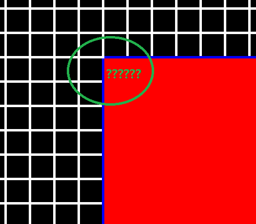
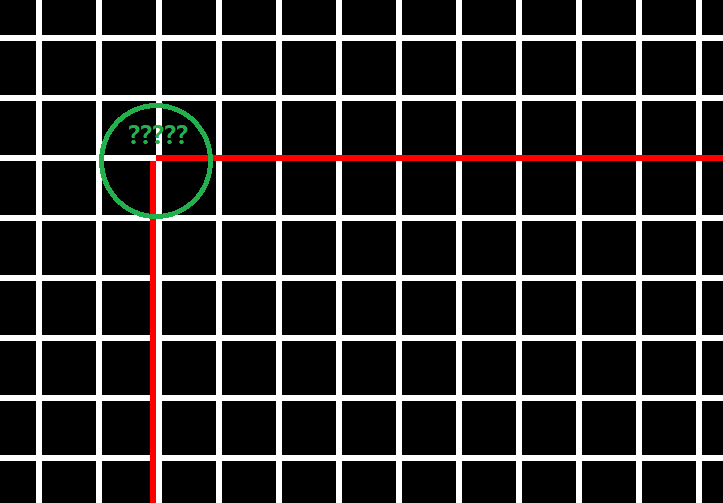
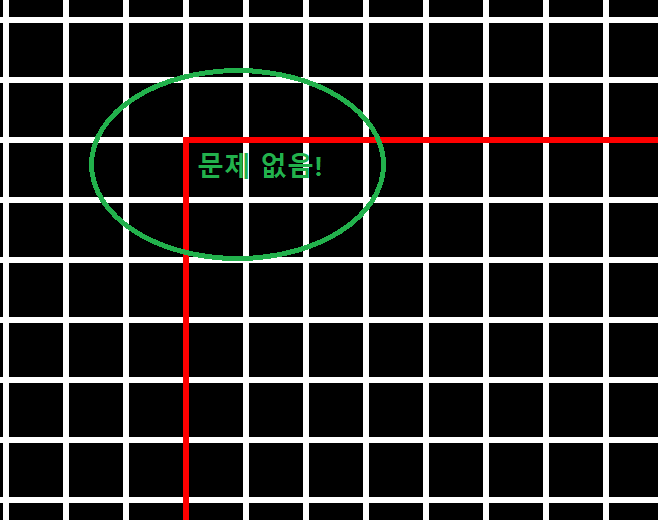

# [BUG] 와이어 프레임 렌더링 시 끝 부분을 이상하게 그리는 버그

이 문서는 와이어 프레임 렌더링 시 끝 부분을 이상하게 그리는 버그에 대한 설명과 그 버그를 수정한 방법에 대한 문서입니다.
<br><br>


## 상황

`PrimitiveShapeShader`의 `DrawWireframeRect2D` 기능을 구현하던 중 다음과 같은 버그를 발견했습니다.



분명히 파란색 선 사이가 채워져 있어야 하지만, 그렇지 않고 공백이 발생했습니다. 이상해서 `PrimitiveShapeShader`의 `DrawRect2D`를 와이어프레임 렌더링으로 설정을 변경해서 렌더링한 결과 다음과 같이 문제가 발생함을 인지했습니다.


<br><br>


## 해결

이는 2D에서만 발생하는 문제로, 레스터화 규칙을 이용하면 해결할 수 있습니다. 모든 2D 좌표를 업데이트할 때, 모든 (x, y) 점에 0.5f 씩 더해주면 됩니다.

```
...
primitiveShapeVertex_["Rect"][0] = Vector3f(leftTopPosition.x + 0.5f, rightBottomPosition.y + 0.5f, 0.0f);
primitiveShapeVertex_["Rect"][1] = Vector3f(leftTopPosition.x + 0.5f,     leftTopPosition.y + 0.5f, 0.0f);
primitiveShapeVertex_["Rect"][2] = Vector3f(rightBottomPosition.x + 0.5f,     leftTopPosition.y + 0.5f, 0.0f);
primitiveShapeVertex_["Rect"][3] = Vector3f(rightBottomPosition.x + 0.5f, rightBottomPosition.y + 0.5f, 0.0f);
...
```

아래와 같이 변경한 뒤에 렌더링을 수행하면 다음과 같습니다.


<br><br>


## 참고
- [stackoverflow : D3D11: How to draw a simple pixel aligned line?](https://stackoverflow.com/questions/5898107/d3d11-how-to-draw-a-simple-pixel-aligned-line)