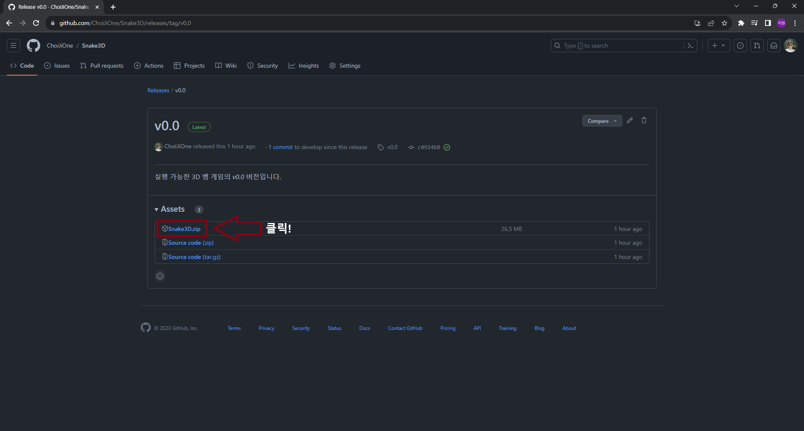
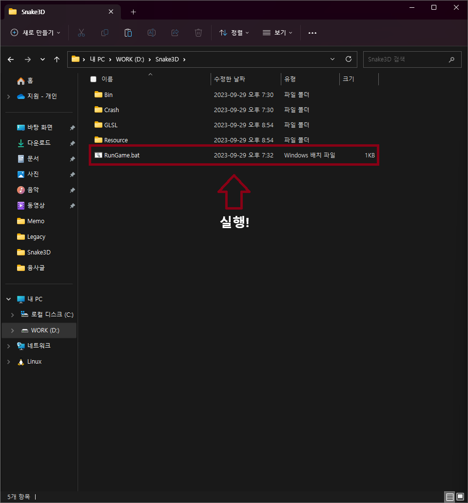
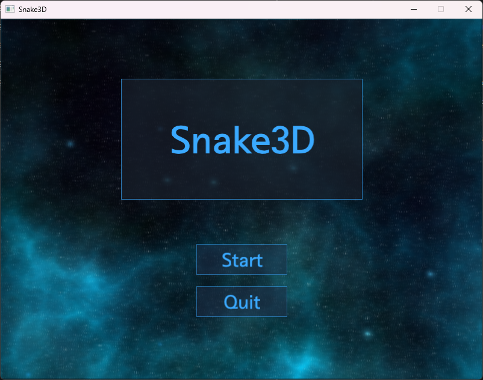
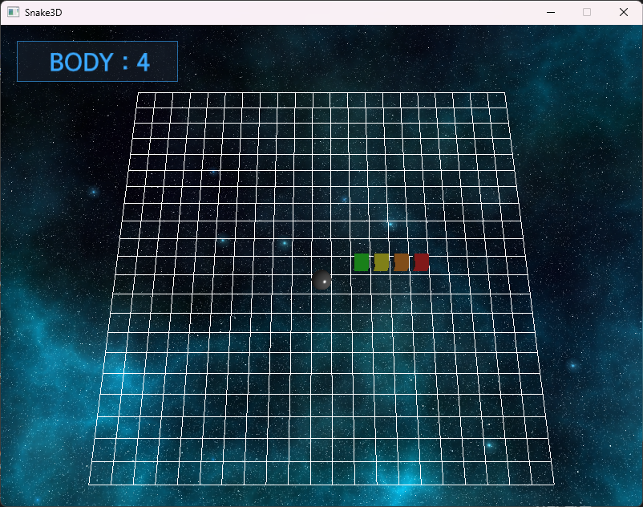
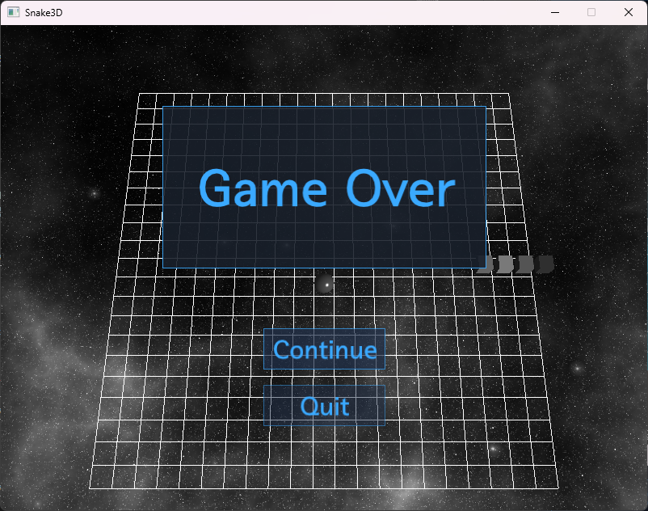

# 게임 다운로드 및 플레이 방법

이 문서는 게임 다운로드 및 플레이 방법에 대한 문서입니다.
  

## 다운로드

실행 가능한 게임 실행 파일을 얻기 위해서는 [v0.0](https://github.com/ChoiJiOne/Snake3D/releases/tag/v0.0)으로 이동한 뒤 `Snake3D.zip`을 클릭합니다.

  

## 게임 실행

다운로드가 완료 되었으면 `Snake3D.zip`의 압축을 해제합니다. 압축을 해제하면 다음과 같은 구조를 볼 수 있는데, `RunGame.bat`를 실행하면 게임을 실행할 수 있습니다.

  

## 게임 실행 화면

게임 실행 화면은 총 3개로, 아래와 같습니다.

### 시작 화면

게임을 실행하면 아래와 같은 화면을 볼 수 있습니다.

시작 화면 내에는 버튼만 있고, 이 버튼들은 좌측 마우스 버튼으로 클릭 가능합니다. 게임의 `Start` 버튼을 클릭하면 게임을 플레이할 수 있고, `Quit` 버튼을 클릭하면 게임이 종료됩니다.

### 플레이 화면

시작 화면에서 `START` 버튼을 클릭하면 아래와 같은 화면을 볼 수 있습니다.

시작하자 마자 몸통의 크기가 4인 뱀이 있는데, 이 뱀은 키보드의 상, 하, 좌, 우 키로 조종할 수 있습니다. 그리드 상에 존재하는 먹이를 먹으면 크기가 1씩 증가하고, 먹이를 7개 먹을 때마다 뱀의 이동 속도가 빨라집니다. 

### 종료 화면 

더 이상 플레이 할 수 없으면 아래의 화면으로 전환됩니다.

플레이가 종료되면 화면은 회색 화면으로 전환되고, 종료 화면의 버튼 또한 좌측 마우스 버튼으로 클릭 가능합니다. 아래의 버튼 중 `Continue` 버튼을 클릭하면 시작 화면으로 돌아가고, `Quit` 버튼을 클릭하게 되면 게임을 종료하게 됩니다.