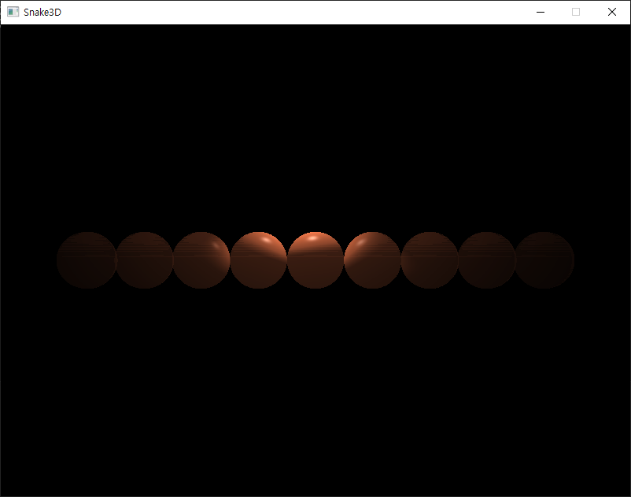
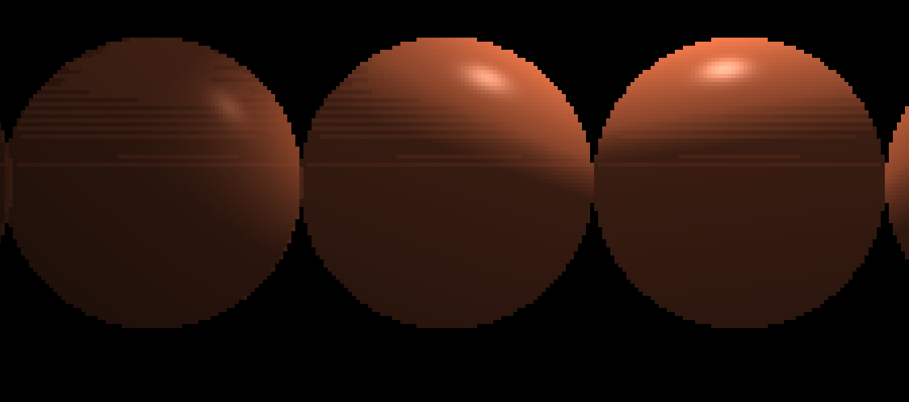
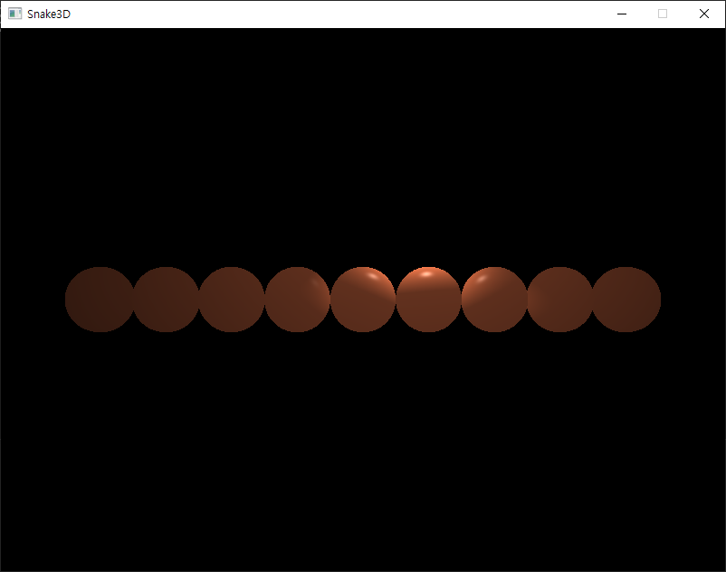
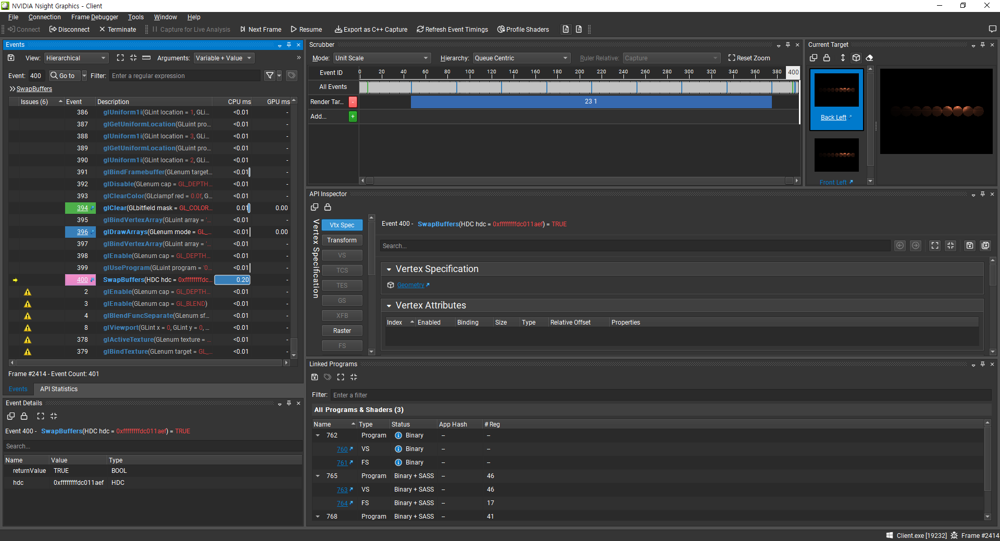
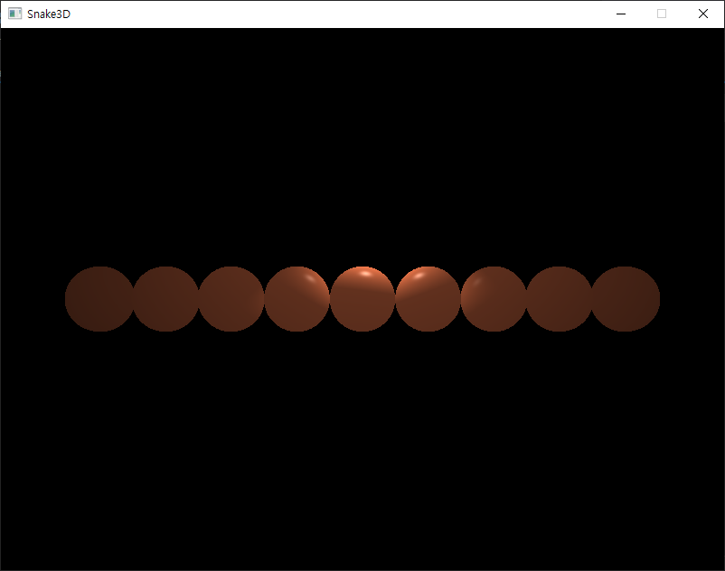

# 알파 블랜딩 활성화 시 의도하지 않은 효과가 렌더링되는 버그

이 문서는 알파 블랜딩 활성화 시 의도하지 않은 효과가 렌더링되는 버그에 대한 문서입니다.
<br><br>


## 상황

`RenderManager` 부분에 알파 블랜딩 활성화/비활성화 기능을 구현한 뒤에 알파 블랜딩을 활성화하여 렌더링한 결과 다음과 같은 렌더링 결과를 얻었습니다.



일부분을 자세히 보면 다음과 같습니다.



알파 블랜딩을 활성화하지 않았을 때는 다음과 같습니다.



<br><br>


## 원인 찾아보기

`NSight`를 이용해서 파이프라인 상태를 캡처한 후 보았을 때는 특이한 점은 없었습니다.



잘못 바인딩된 요소는 없었고, 포스트 프로세싱은 사용하지 않는 상황이므로, 버그가 발생한 렌더링을 수행하는 셰이더(SpotLight.frag)를 보았습니다.

```GLSL
// SpotLight.frag

#version 450 core

layout(location = 0) in vec3 inWorldPosition;
layout(location = 1) in vec3 inNormal;

layout(location = 0) out vec4 color;

struct SpotLight
{
	vec3 position;
	vec3 direction;

	float innerCutOff;
	float outerCutOff;

	vec4 ambient;
	vec4 diffuse;
	vec4 specular;

	float constant;
	float linear;
	float quadratic;
};

struct Material
{
	vec4 ambient;
	vec4 diffuse;
	vec4 specular;
	float specularPower;
};

uniform vec3 viewPosition;

uniform SpotLight spotLight;
uniform Material material;

void main()
{
	// ambient
	vec4 ambient = spotLight.ambient * material.ambient;

	// diffuse
	vec3 norm = normalize(inNormal);
	vec3 lightDirection = normalize(spotLight.position - inWorldPosition);
	float diff = max(dot(norm, lightDirection), 0.0f);
	vec4 diffuse = spotLight.diffuse * (diff * material.diffuse);

	// specular
	vec3 viewDirection = normalize(viewPosition - inWorldPosition);
	vec3 reflectDirection = reflect(-lightDirection, norm);
	float spec = pow(max(dot(viewDirection, reflectDirection), 0.0f), material.specularPower);
	vec4 specular = spotLight.specular * (spec * material.specular);

	// intensity
	float theta = dot(lightDirection, -spotLight.direction);
	float epsilon = (spotLight.innerCutOff - spotLight.outerCutOff);
	float intensity = clamp((theta - spotLight.outerCutOff) / epsilon, 0.0f, 1.0f);

	// attenuation
	float dist = length(spotLight.position - inWorldPosition);
	float attenuation = 1.0f / (spotLight.constant + spotLight.linear * dist + spotLight.quadratic * dist * dist);

	ambient *= attenuation;
	diffuse *= (intensity * attenuation);
	specular *= (intensity * attenuation);

	color = ambient + diffuse + specular;
}
```

바로 원인을 찾을 수 있었습니다. 라이트의 Ambient 요소를 계산하는 부분은 다음과 같습니다.

```GLSL
...
vec4 ambient = spotLight.ambient * material.ambient;
...
```

여기서 `spotLight.ambient`의 alpha 값은 1.0f이고, `material.ambient`의 alpha 값 또한 1.0f 이므로, 계산되는 Ambient 요소의 alpha 값 또한 1.0f 입니다. 여기서는 문제가 없지만, Diffuse 요소나 Specular 요소를 계산할 때는 문제가 발생할 수 있습니다.

```GLSL
...
	// diffuse
	vec3 norm = normalize(inNormal);
	vec3 lightDirection = normalize(spotLight.position - inWorldPosition);
	float diff = max(dot(norm, lightDirection), 0.0f);
	vec4 diffuse = spotLight.diffuse * (diff * material.diffuse);

	// specular
	vec3 viewDirection = normalize(viewPosition - inWorldPosition);
	vec3 reflectDirection = reflect(-lightDirection, norm);
	float spec = pow(max(dot(viewDirection, reflectDirection), 0.0f), material.specularPower);
	vec4 specular = spotLight.specular * (spec * material.specular);

	// intensity
	float theta = dot(lightDirection, -spotLight.direction);
	float epsilon = (spotLight.innerCutOff - spotLight.outerCutOff);
	float intensity = clamp((theta - spotLight.outerCutOff) / epsilon, 0.0f, 1.0f);

	// attenuation
	float dist = length(spotLight.position - inWorldPosition);
	float attenuation = 1.0f / (spotLight.constant + spotLight.linear * dist + spotLight.quadratic * dist * dist);

	ambient *= attenuation;
	diffuse *= (intensity * attenuation);
	specular *= (intensity * attenuation);
...
```

`Diffuse` 요소를 계산할 때 사용하는 `diff`와 `Specular` 요소를 계산할 때 사용하는 `spec` 값은 특별한 경우를 제외하고는 1.0f이 아닙니다. 1.0f 보다 크면 상관 없지만, 1.0f 보다 작을 때는 `Diffuse` 요소나 `Specular` 요소의 alpha 값에 영향을 줍니다. 게다가 `intensity`와 `attenuation` 또한 alpha 값에 영향을 미칩니다.
<br><br>


## 해결(?)

저 상태에서 `color`의 alpha 값 강제로 1.0f를 대입할 경우 다음과 같은 결과를 볼 수 있습니다.

```GLSL
...
color = ambient + diffuse + specular;
color.a = 1.0f;
...
```



위의 이미지 처럼, 기존의 문제는 발생하지 않습니다. 따라서 여기에서의 해결책은 다음 두 가지라고 볼 수 있습니다.

1. 모든 색상을 RGBA(GLSL에서는 vec4)으로 연산한 다음 마지막에 alpha 값을 강제로 1.0f으로 설정한다.
2. 셰이더 내의 모든 색상은 RGBA에서 RGB(GLSL에서는 vec3)으로 바꾼다.