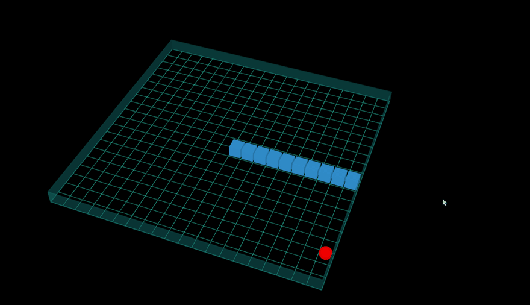

# 프로젝트 개요

이 문서는 `Snake3D` 프로젝트의 개요 문서입니다.
  

## 동기

이전 프로젝트들은 모두 단순한 2D, 3D 렌더링 기반의 게임 개발 프로젝트였습니다. 이제는 게임 퀄리티 관점에서 한 단계 더 도약하고자 라이팅, 포스트 프로세싱, 스카이 박스와 같이 게임에 조금 더 그럴듯한 효과를 부여하는 게임을 개발하고자 하여 이 프로젝트를 진행하게 되었습니다.
  

## 목표

이 프로젝트의 목표는 다음과 같습니다.

> 이전 프로젝트들보다 더 나은 그래픽 효과가 포함된 3D 뱀 게임 개발

이 프로젝트의 세부 목표는 다음과 같습니다.
- Windows 플랫폼에서 플레이 가능한 3D 피하기 게임 개발
- 라이팅, 포스트 프로세싱, 스카이 박스 등의 그래픽 효과 구현
- 로컬에서 크래시 덤프 파일 수집 기능 구현
- CMake를 이용한 Visual Studio 솔루션 및 하위 프로젝트 세팅 자동화 기능 구현
- CMake 기반의 빌드 자동화 스크립트 구현
- Github에서 다운로드 받으면 즉시 실행 가능한 형태로 배포
  

## 개발 기간

이 프로젝트의 전체 개발 기간은 `2023.09.11 ~ 2023.09.24` 으로 약 2주입니다.
  

## 기대 수준

이 프로젝트의 기대 수준은 다음과 같습니다.

  

## 참조
- [How to create a 3D snake game with Javascript (attached source code and game link)](https://dev.to/hightopo/how-to-create-a-3d-snake-game-with-javascript-attached-source-code-and-game-link-3bci)